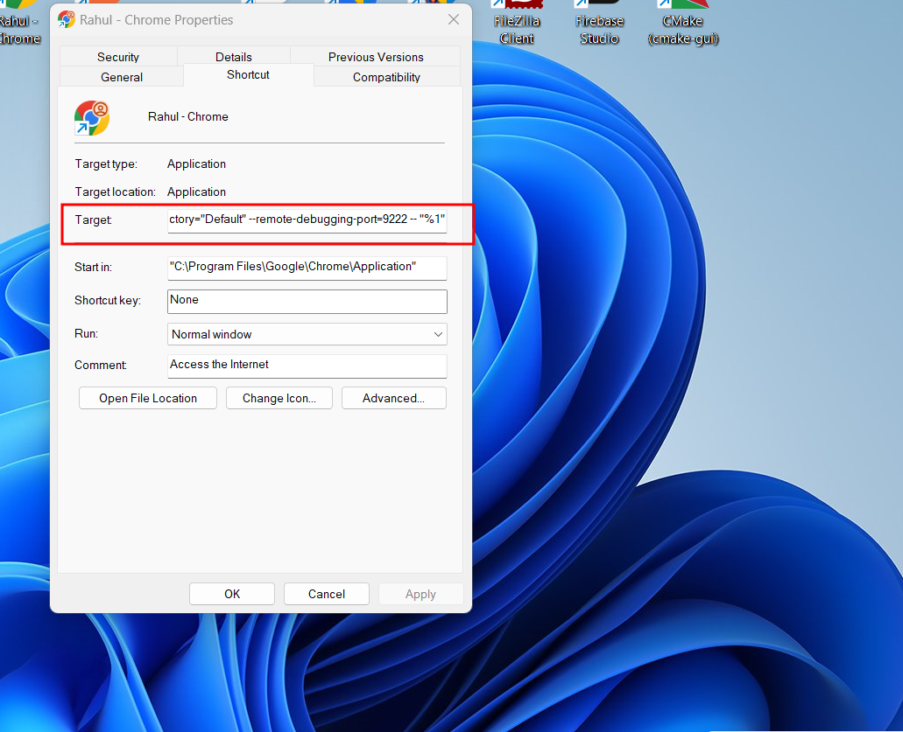
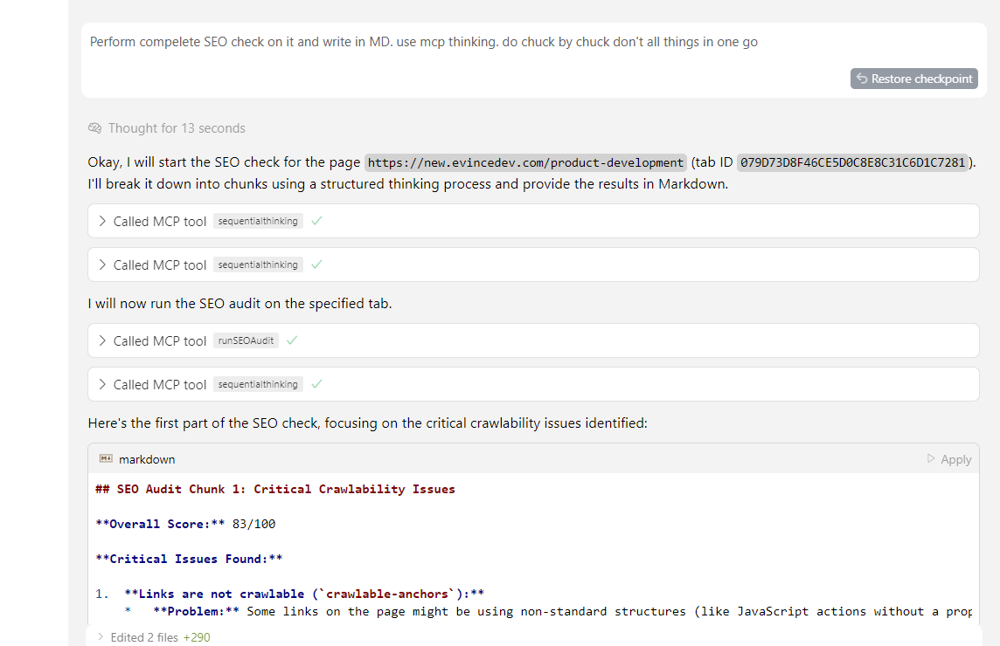
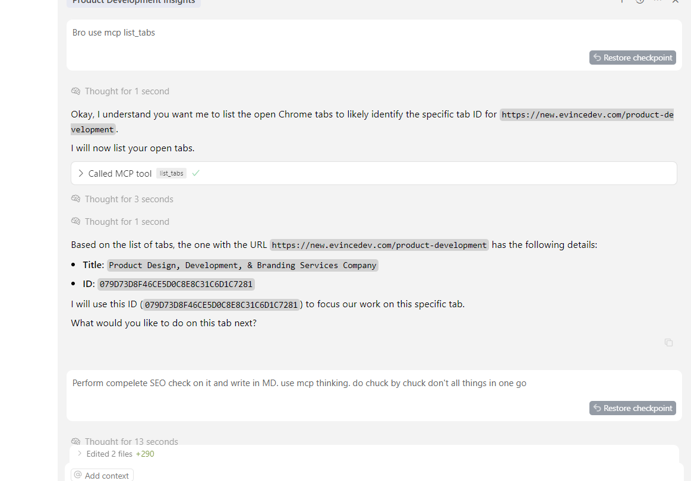
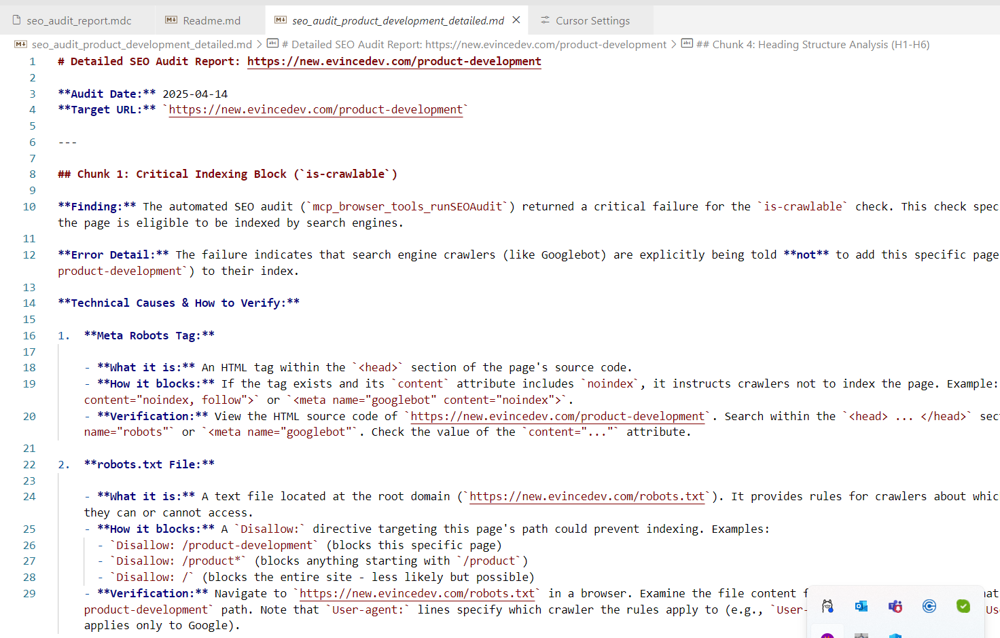
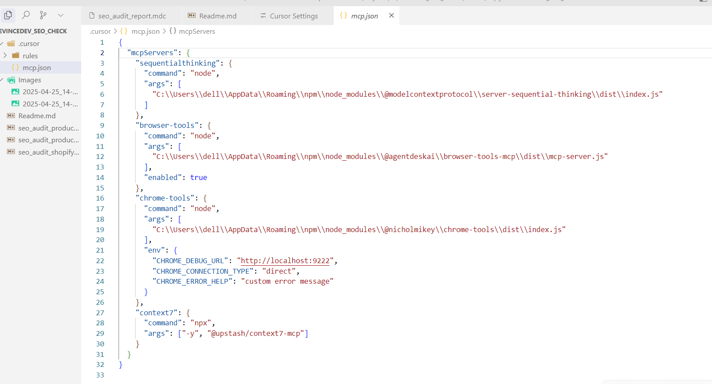
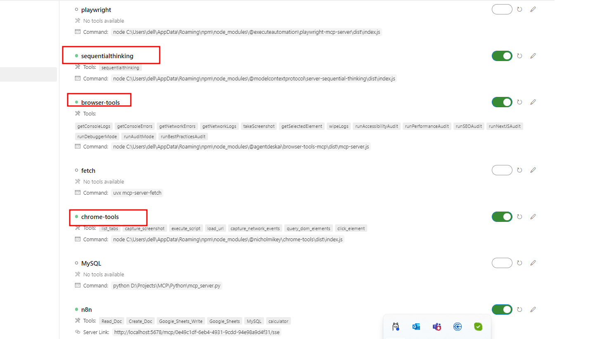
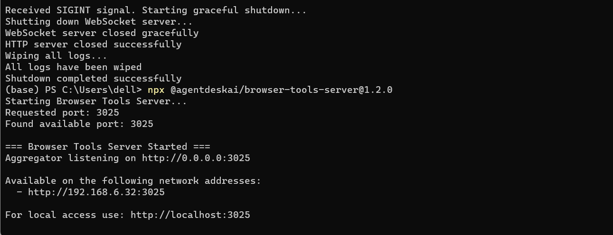

# MCP SEO Analyzer Task Documentation

---

## Task 1: SEO Analyzer

**Task Details:**  
Making an SEO tool that performs:

- Accessibility Audit
- Performance Audit
- SEO Audit
- Next.js Audit
- Best Practice Audit

Uses MCP thinking and browser tools for automation. Follows MCP process for tab focus, script execution, audits, and reporting. Documents process, challenges, solutions, implementation steps, guidelines, and hours utilized.

**Duration (Hours):** 4  
**White Paper Link:** (Add link)  
**Remarks:** (Add remarks)

---

### Process

1. Use MCP `list_tabs` to focus on the correct browser tab or open a new one.
2. Use MCP tools to run audits: Accessibility, Performance, SEO, Next.js, Best Practices.
3. Collect console logs, network logs, screenshots, and selected elements as needed.
4. Document findings, challenges, and solutions in the daily log.

### Challenges

- Handling non-crawlable anchors and blocked indexing.
- Ensuring all images have descriptive alt text.
- Correcting heading structure and meta descriptions.

### Solution

- Refactor anchor tags to include valid hrefs.
- Update robots.txt and meta tags to allow indexing.
- Review and enhance image alt text and heading tags.

### Implementation Steps

- Manual and automated audits using MCP tools.
- Code and content updates based on audit results.
- Verification and re-audit.

### Guidelines

- Always use MCP thinking for automation and reporting.
- Document every step, challenge, and solution.
- Attach screenshots and logs as evidence.

### Hours Utilized

- (Fill in daily as work progresses.)

### Images

- 
- 
- 
- 
- 
- 
- 

---

Run in powershell or terminal
npx @agentdeskai/browser-tools-server@1.2.0

Add this parameter in chromer shortcut or execute chrome with it
--profile-directory="Default" --remote-debugging-port=9222 -- "%1"
